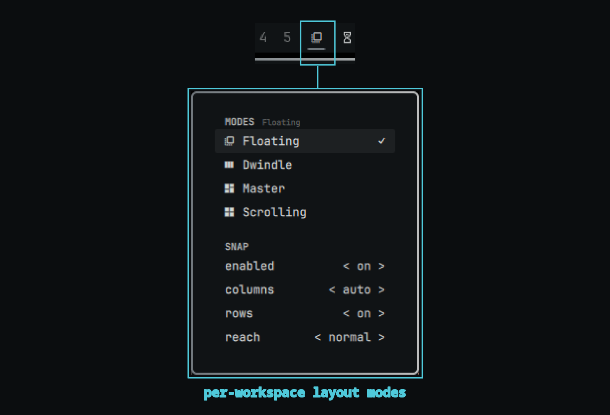

# Omarchy Modes Switcher

Per-workspace layout modes for Hyprland, switched from an Omarchy bar widget.



Each workspace gets its own mode:

- **Floating** — windows open floating and stay that way
- **Dwindle** — Hyprland's default binary-tree tiling
- **Master** — master/stack tiling
- **Scrolling** — scrolling layout

The widget shows the focused workspace's mode; click it to open the mode menu. Switching rewrites a generated Hyprland drop-in, reloads the compositor, and reconciles already-open windows on that workspace (floats them or tiles them).


## Snap zones

An optional Windows-style snap assist, configured from the **SNAP** section at the bottom of the mode menu.

When enabled, `SUPER + drag` a window (Omarchy's native move) toward a screen edge and a cue shows the exact snap it will take; release to land it:

- **Side edges** → left/right column, full height (the default is a single row of 2 columns).
- **Top/bottom edges** → that column's **upper/lower row** (half height — up to 2 rows within each column).
- **Ultrawides** (~21:9, 34″): the middle stretch of the top/bottom edges instead offers the full **middle column**; super-ultrawide (~32:9, 49″) offers a wider middle spanning two of four columns.
- **All the way up** (over the bar / top bezel) → fullscreen snap.
- Snapped geometry respects your configured `general:gaps_in` / `general:gaps_out`, so a snapped window lands where a tiled window would.
- No cue in the middle of the screen — nothing shows until the cursor is near an actionable edge, and only the snap that would fire is previewed.
- Works in every mode — tiled windows are floated and placed; floating windows just move. Dropping away from edges (or on the bar) leaves the window where the native drag put it — a plain `SUPER + click` never snaps.
- The cue is a click-through layer-shell surface that only exists while a snap is armed; it never eats your pointer.
- All settings persist to `~/.local/state/omarchy-modes/snap-assist.json`; the enabled flag also regenerates the drop-in, adding/removing two `non_consuming` `SUPER + mouse:272` binds that observe the press/release while Omarchy's drag bind still does the moving.

### Snap settings

| Setting | Default | Options | Description |
| --- | --- | --- | --- |
| `enabled` | off | on/off | Arm the snap binds |
| `columns` | auto | auto/2/3/4 | Columns per monitor. `auto` detects from aspect: 2 below 1.9:1, 3 on ~21:9, 4 on ~32:9. A fixed number forces that split on every monitor. |
| `rows` | on | on/off | The top/bottom-edge half snaps within each column. Off leaves the middle column and fullscreen only. |
| `reach` | normal | near/normal/far | How close to an edge the cue and snap arm (70% / 100% / 150% of the base distance). |

## Install

```
omarchy plugin add https://github.com/v3moreno/omarchy-modes-switcher --enable
```

Then add the **Modes** widget to the bar (it defaults to the left section).

## Settings

| Setting | Default | Description |
| --- | --- | --- |
| `enableKeybinds` | `false` | Emit `SUPER + ALT + SPACE` → cycle mode for the focused workspace |

## IPC

The widget exposes an IPC target for scripts or your own bindings:

```
qs ipc -n -p "$OMARCHY_PATH/shell" call omarchy-modes.switcher cycle
qs ipc -n -p "$OMARCHY_PATH/shell" call omarchy-modes.switcher setMode master
qs ipc -n -p "$OMARCHY_PATH/shell" call omarchy-modes.switcher snapToggle
```

A second target controls the menu itself:

```
qs ipc -n -p "$OMARCHY_PATH/shell" call omarchy-modes.switcher.widget open
qs ipc -n -p "$OMARCHY_PATH/shell" call omarchy-modes.switcher.widget toggle
```

Inside the menu, `Up`/`Down` (or `j`/`k`) move, `Enter` activates, and
`Left`/`Right` rotate the SNAP settings shown as `< value >` — `Esc` closes.

## How it works

- Choices are persisted to `~/.local/state/omarchy-modes/state.json`.
- The widget generates `~/.local/state/omarchy/toggles/hypr/omarchy-modes.lua` with one `hl.workspace_rule` per configured workspace, plus a `float` window rule for floating-mode workspaces. Omarchy auto-loads every file in that directory on `hyprctl reload`.
- Generated Lua only ever carries validated workspace ids and mode names — window titles, classes, and other strings never reach it.
- Disabling or removing the plugin deletes the drop-in and reloads Hyprland. `state.json` is kept, so re-enabling restores your modes.

## Notes

- Pairs well with [omarchy-resizeable](https://github.com/v3moreno/omarchy-resizeable), which enables border-drag resizing — handy in floating mode.
- A workspace with no recorded mode shows its live layout (or Dwindle) until you pick one.

## License

MIT — see [LICENSE](LICENSE).
